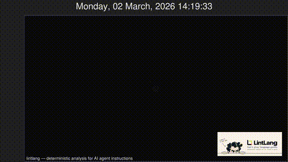

<div align="center">

# LintLang


**Static analysis for the instructions your AI agents execute.**

LintLang is developed by [Hermes Labs](https://hermes-labs.ai).

Hermes Labs is an agentic infrastructure company building the reliability layer for autonomous systems.

[](https://github.com/hermes-labs-ai/lintlang/actions/workflows/ci.yml)
[](https://pypi.org/project/lintlang/)
[](https://pypistats.org/packages/lintlang)
[](https://pypi.org/project/lintlang/)
[](LICENSE)
[](https://scorecard.dev/viewer/?uri=github.com/hermes-labs-ai/lintlang)
[](https://doi.org/10.5281/zenodo.20471007)

[Product page](https://lintlang.ai/) · [Browser playground](https://hermes-labs.ai/lintlang#playground) · [PyPI](https://pypi.org/project/lintlang/) · [Documentation](llms-full.txt)

</div>


LintLang catches ambiguous tool descriptions, missing operational limits, schema/description mismatches, conflicting output contracts, and other bounded instruction defects before a model runs.

**Local · deterministic · zero LLM calls · no telemetry or network access during a scan**

## Quick start

Requires Python 3.10+.

Run once without installing:

```bash
uvx lintlang scan AGENTS.md
```

Or install it:

```bash
pip install lintlang
lintlang scan AGENTS.md
```

On macOS, you can install from the [Hermes Labs Homebrew tap](https://github.com/hermes-labs-ai/homebrew-tap#install-a-tool):

```bash
brew install hermes-labs-ai/tap/lintlang
lintlang scan AGENTS.md
```

Use the instruction file your agent actually reads: `AGENTS.md`, `CLAUDE.md`, `GEMINI.md`, GitHub Copilot instructions, or another supported prompt/configuration path.

[No instruction file yet? Try the checkout-free first run.](llms-full.txt#first-run-without-a-checkout)

A normal scan reports findings without blocking:

```text
REVIEW — findings detected
```

To make `HIGH` or `CRITICAL` findings fail CI:

```bash
lintlang scan AGENTS.md --fail-on fail
```

## What LintLang catches

- **Ambiguous tools** — empty, vague, or overlapping descriptions without a clear selection rule.
- **Missing bounds** — retries, loops, or tool use without explicit stopping or progress conditions.
- **Contract mismatches** — descriptions that disagree with schemas, malformed message roles, or conflicting output-format requirements.
- **Context and prompt defects** — vague or unscoped context, instruction files that point at project files that no longer exist, embedded prompt issues, and selected problems in supported Python prompt pipelines.
- **Skill metadata** — a `SKILL.md` whose front-matter description is missing, over the 1024-character limit, or never says when to use the skill; a `name` that is invalid or differs from its directory.

Every finding has a stable identifier, severity, evidence, and a suggested review action where the parser can justify one. Findings in text files carry the line number.

Every result also says what it inspected:

```text
FAIL — 2 HIGH
Inspected: 18 tools (18 described, 18 with a schema)
```

A file LintLang could read nothing from is reported `SKIPPED`, never `PASS`.

Reports also explain the separate HERM confidence label using its current
coverage proxies: whether prompt-like framing and input-boundary language were
detected. The guidance is conditional on the document's purpose; reference
material can naturally receive lower confidence. This label is not a
statistical probability, a finding-certainty estimate, or the structural
PASS/REVIEW/FAIL verdict. The current coverage bands are high at 90% or more,
medium at 75% or more, and low below 75%.

### Conservative automatic rewrite

`scan --fix` currently handles one exact case: a direct, standalone
`Don't be verbose` instruction (with or without a final period; curly
apostrophe is also accepted). It prints the unified diff before writing. Use
`--dry-run` to preview without writing, or `--backup` to preserve the exact
original bytes as `FILE.lintlang.bak` before the write; an existing backup is
never overwritten.

```bash
lintlang scan AGENTS.md --fix --dry-run
lintlang scan AGENTS.md --fix --backup
```

The file must start with a top-level `# Instructions` heading, followed only
by blank lines and the supported instruction as its first body line. Other
headings, preambles, quoted, commented, code, and ambiguous contexts are left
untouched; malformed lexical scope fails closed. Only one explicit `.md`, `.txt`, or `.prompt` file is
accepted. H1/H2 suggestions that would
invent tool behavior, output formats, or scope; security negatives; other
priority rules; and cross-file conflicts remain manual. This is a narrow
syntactic rewrite, not an automatic-fix score or a claim that other
suggestions are safe to apply.

LintLang does not decide whether arbitrary prose is true, predict runtime model behavior, or certify an agent as safe.

## What it can scan

| Surface | Examples |
| --- | --- |
| Coding-agent instructions | `AGENTS.md`, `CLAUDE.md`, `GEMINI.md`, Copilot instructions, `SKILL.md` with front matter |
| Tool definitions | MCP `tools/list` dumps and manifests, OpenAI/Anthropic/Gemini function lists, `mcpServers.*.tools`, VS Code `languageModelTools` — found by shape in any JSON or YAML, object or array root |
| Agent configuration | YAML and JSON with a system prompt, messages, tools, or output schema |
| Prompts and instructions | Markdown, text, and prompt files |
| Python | Supported extractable pipeline patterns |
| Invocation | Individual files, directories, repository discovery, standard input |

See the [technical reference](llms-full.txt) for detector coverage, extraction behavior, and the CLI flags for repository discovery (`--discover`) and standard-input scanning (`--stdin-filename`).

## Use it where instructions change

### Local review

```bash
lintlang scan AGENTS.md
```

### Existing repositories

Create a baseline for findings already reviewed, then gate only new findings:

```bash
lintlang scan AGENTS.md --write-baseline .lintlang-baseline.json
lintlang scan AGENTS.md \
  --baseline .lintlang-baseline.json \
  --fail-on review
```

See [baseline adoption](docs/baselines.md) for matching semantics and maintenance.

### GitHub CI and Code Scanning

Generate a pinned workflow for a known instruction path:

```bash
lintlang init --github --path AGENTS.md
```

The generated workflow runs the same scanner and can upload SARIF for GitHub Code Scanning.

## Integrations

LintLang fits existing developer workflows rather than requiring a runtime service.

| Integration | Use |
| --- | --- |
| GitHub Action | Scan instruction paths in pull requests and CI |
| GitHub Code Scanning | Upload SARIF findings beside code findings |
| pre-commit | Review instructions before commit |
| Claude Code | Optional non-blocking guidance after supported edits |
| GitHub Copilot CLI | On-demand audit of a named instruction or tool-definition file |
| Gemini CLI | Optional non-blocking guidance after supported edits |
| OpenCode | Optional non-blocking post-edit guidance |
| Hermes Agent | Bounded pre-verification of supported edits |
| MegaLinter | Opt-in external plugin for existing MegaLinter users |

See the [integrations and ecosystem guide](docs/integrations.md) for setup instructions and public ecosystem references. The [GitHub Copilot CLI plugin guide](integrations/copilot-cli/README.md) gives the direct install command.

## Results and exit behavior

| Verdict | Meaning |
| --- | --- |
| `PASS` | No remaining `MEDIUM` or higher findings |
| `REVIEW` | At least one `MEDIUM` finding remains |
| `FAIL` | At least one `HIGH` or `CRITICAL` finding remains |
| `ERROR` | A requested input could not be inspected, including a scan that inspected zero files or nothing in any file |
| `SKIPPED` | The file holds nothing LintLang inspects (a `package.json`, a JSON Schema, Python with no prompt). Shown with its reason; never counted as `PASS` |

Findings are non-blocking by default. Use `--fail-on` to choose a CI threshold. Input errors remain nonzero regardless of that threshold; a scan that inspects zero files is one of them, and `--allow-empty` is the opt-out for an input that may legitimately be empty. See the [GitHub CI guide](docs/github.md#findings-thresholds-and-input-errors) for the exact per-channel behavior.

Machine-readable JSON and SARIF output are available for automation.

## Where LintLang fits

```text
syntax and schema validation
        ↓
LintLang static instruction checks
        ↓
runtime agent evaluation
        ↓
domain and security review
```

LintLang is an authoring and review control. It does not run models, observe tool selection at runtime, prove semantic correctness, replace evaluation, or establish that an agent is production-safe.

A clean scan means only that the selected static checks found no covered defects in the recognized content.

## Evidence

[Character.AI’s public Larch repository](https://github.com/character-ai/larch) pins a LintLang release in recurring CI. [MegaLinter](https://github.com/oxsecurity/megalinter) catalogs LintLang as the `AI_LINTLANG` external plugin.

See the [integrations and ecosystem guide](docs/integrations.md) for additional public references.

LintLang is an engineering evolution of Hermes Labs’ research into structural epistemic failure modes in language models. See [Research and design lineage](docs/research.md).

## Documentation

| Need | Document |
| --- | --- |
| Detector behavior and rule IDs | [Technical reference](llms-full.txt) |
| Existing-repository adoption | [Baselines](docs/baselines.md) |
| Integrations and ecosystem | [Integration guide](docs/integrations.md) |
| CI and Code Scanning | [GitHub initializer](docs/github.md) |
| Research and design lineage | [Research](docs/research.md) |
| Claude Code | [Plugin guide](integrations/claude-code/README.md) |
| Gemini CLI | [Extension guide](docs/gemini-cli-extension.md) |
| MegaLinter | [Plugin guide](mega-linter-plugin-lintlang/README.md) |
| Product scope and intent | [INTENT.md](INTENT.md) |
| Releases | [CHANGELOG.md](CHANGELOG.md) |
| Contribution | [CONTRIBUTING.md](CONTRIBUTING.md) |
| Security | [SECURITY.md](SECURITY.md) |

## 🎬 Project Visualization



_Video genereerd door de [Gource workflow](.github/workflows/gource.yml). De workflow genereert een MP4-video en een GIF-thumbnail die automatisch wordt bijgewerkt bij elke commit._

## Contributing

Bug reports, disputed findings, reproducible false positives, documentation corrections, and focused contributions are welcome. Read [CONTRIBUTING.md](CONTRIBUTING.md) before opening a pull request.

## License

[Apache License 2.0](LICENSE)
